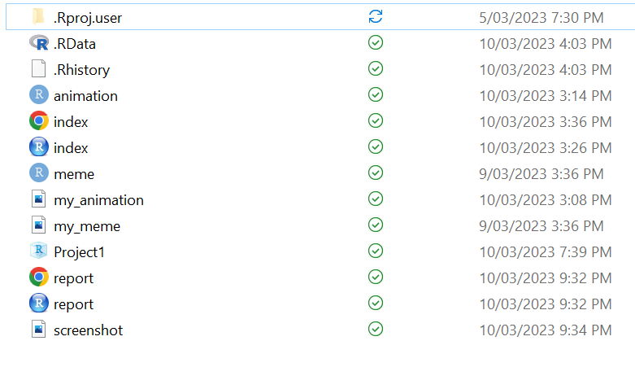

```{r setup, include=FALSE,}
knitr::opts_chunk$set(echo = FALSE, message = FALSE, error = FALSE, warning = FALSE)
```

## Project requirements
GitHub is a popular platform for us to share our creations with the world. The purpose of our project is to demonstrate our *imaginations* with the wider audience. GitHub provides all the tools we need, it has a repository function to store all of our creativity. We have also collated all of our memes within one GitHub page, which showcases some *fine arts* in a spectacular display. 

* [Jump right into our repository](https://github.com/BenCodes01/Stats220)
* [Behold our *fine arts* gallery](https://bencodes01.github.io/Stats220/)

*Here is a secret hidden folder giving us a peek of where the magic emanates from...*


The project manifested creativity with stylish appeal. The project requirements section was written in a way to capture attention through the use of enthusiastic language, and *italic* style font is used on descriptive terms to stimulate the audience. To make the webpage more interesting, additional CSS features such as blocked paragraphs was used to make everything more neat and tidy.

## Learning reflection
One important idea I learnt from Module 1 is producing work that is readable and maintainable. I realized that having the correct amount of spaces when necessary, and helpful comments made my work a lot more easy to work back on.

In the early days of programming when RStudio was non-existent, webpages were written in the most tedious manner. This process used to be a nightmare, but it became more interesting and easier as more advanced data technologies was developed. RStudio made programming a very exciting experience for me, and I would like to explore further into more advanced technologies such as artificial intelligence which has the potential to produce magnificent results.


```{css}
h2 {
  color: #4169E1;
  text-align: left;
}
body {
  font-family: "Inconsolata", "monospace";
  font-size: 1.3em;
  font-weight: bold;
  background-color: #f3f3f3;
  color: #89CFF0; 
}
p {
  border: 2px solid #89CFF0;
  box-shadow: 10px 5px 5px #ADD8E6;
  border-radius: 5px;
  background: white;
  font-size: 1.3em;
  color: black;
}
ul {
  font-size: 1.3em;
}
```
