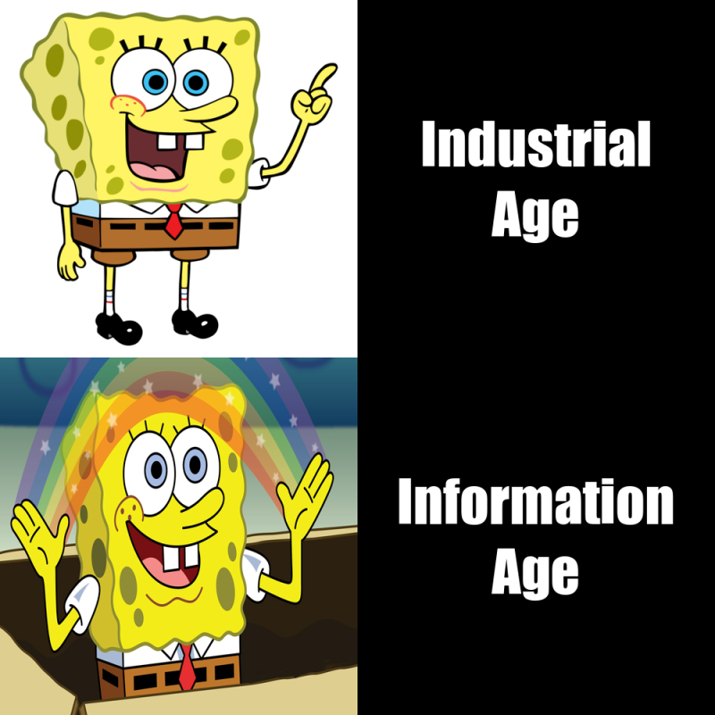
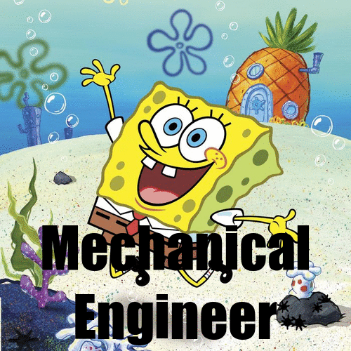

```{r setup, include=FALSE,}
knitr::opts_chunk$set(echo = TRUE, message = FALSE, error = FALSE, warning = FALSE)
```


<!-- My meme code section -->
## My meme
Many fascinating ideas were materialized during the industrial age, those amazing inventions excited the world, however, it was only at the dawn of digitalization that the world began to believe in its fantasies. 

```{r file='meme.R', eval=FALSE}

```

<!-- My animated GIF code section -->
## My animated GIF
Mechatronics engineering is a fancy name for a new field that combines the classical engineering disciplines of mechanical and electrical, but Spongebob and Patrick would like to keep it classical with 'mechanictrical engineer'.

```{r file='animation.R', eval=FALSE}

```

<!-- CSS code section -->
## CSS code 
```{css}
h2 {
  color: #4169E1;
  text-align: left;
}
body {
  font-family: "Inconsolata", "monospace";
  font-size: 1.3em;
  font-weight: bold;
  background-color: #f3f3f3;
  color: #89CFF0; 
}
p {
  border: 2px solid #89CFF0;
  box-shadow: 10px 5px 5px #ADD8E6;
  border-radius: 5px;
  background: white;
  font-size: 1.3em;
  color: black;
}

```


